# What the Sleeve Feels: Explainable Machine Learning for Textile Pressure-Based Postural Screening

An explainable, subject-independent re-analysis of the **Smart-Sleeve** pressure-mapping dataset. A knitted piezoresistive sleeve worn on the forearm produces image-like pressure frames; we turn them into 29 interpretable features, classify everyday postures into three coarse screening categories with XGBoost, and probe **generalization**, **interpretability**, and **robustness to donning offsets**.

<p align="center">
  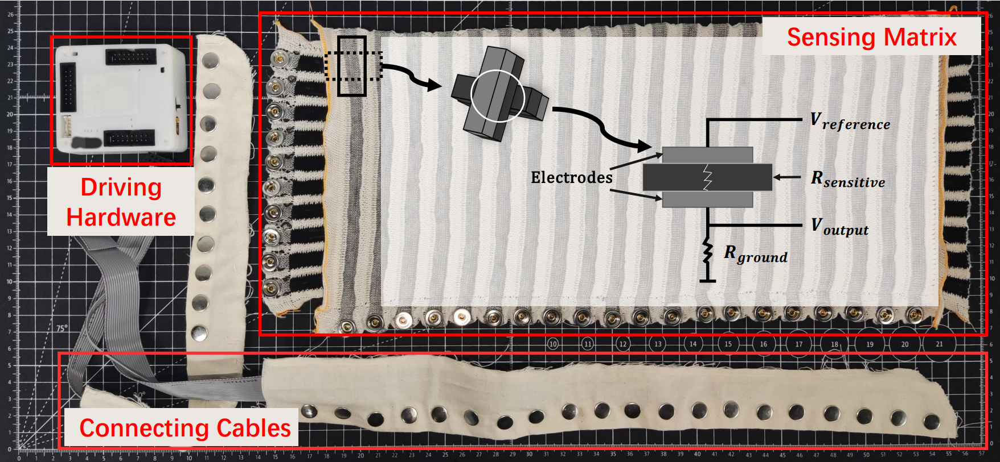
</p>

---

## Highlights

- **Subject-wise protocol.** 10 train / 2 validation / 2 held-out test subjects. All data-driven thresholds are estimated from training subjects only, so there is no leakage.
- **29 interpretable features** covering global intensity, activation area, spatial center of pressure, quadrant asymmetry, distribution complexity, and short-horizon temporal change.
- **XGBoost reaches 0.818 accuracy, 0.788 balanced accuracy, 0.801 macro F1** on unseen subjects (ROC AUC 0.942). Frame-level bootstrap 95% CI is about ±0.01.
- **LOSO cross-validation:** mean macro F1 of 0.770 (SD 0.059). Subject variance, not test noise, dominates uncertainty.
- **A small 2D-CNN on raw frames performs about the same** (0.795 macro F1), so the interpretable tabular pipeline is not left behind.
- **SHAP shows circumferential features matter most** (`cop_x`, `var_x`), more than raw pressure magnitude.
- **Donning-rotation stress test** shows asymmetric degradation, linked directly to the top SHAP feature.

> **Note:** The three screening categories are a documented modeling construct based on the semantic content of the activity labels. They are **not** a validated clinical taxonomy, and no injury or risk prediction is claimed.

---

## Dataset

We use the public **Smart-Sleeve** dataset ([Xu, Deng & Cheng, USTC, 2023](https://github.com/xghgithub/Smart-Sleeve-Dataset)):

- 14 healthy right-handed subjects (3 female), sleeve on the right arm
- 18 everyday activities, 10 rounds each in random order, with the sleeve removed and re-worn between rounds
- Each frame is a **20 × 10** matrix of 12-bit ADC readings at 50 Hz (200-point piezoresistive matrix, 40 cm × 18 cm)

<p align="center">
  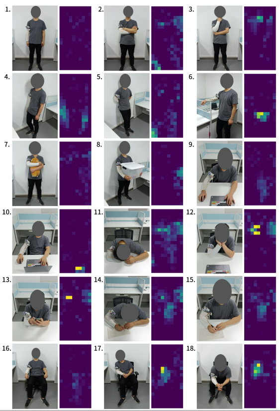
</p>
<p align="center"><em>The 18 activities and their pressure signatures. Image reproduced from the Smart-Sleeve dataset repository.</em></p>

### Screening-category mapping

| Class | Activities |
|---|---|
| **Neutral / acceptable** | Standing, back against the wall, writing with a straight back, sitting with hands on the armrests |
| **Functional / transitional** | Folding arms, thinking, side against the wall, arm on the baffle, hugging a doll, carrying a box |
| **Potentially undesirable** | Leaning forward or back at a desk, sleeping on the table, holding cheeks, using a mobile phone, writing with a hunched back, sitting leaning to one side, sitting with arms on the legs |

Two alternative mappings are also tested (see [Class-mapping sensitivity](#class-mapping-sensitivity)).

---

## Method Overview

1. **Preprocessing:** sub-sample every 4th frame (12.5 Hz effective) and cap each activity segment at 250 frames. This gives 84,095 labeled frames from 140 subject-round recordings.
2. **Feature engineering (29 features):** global intensity (mean, max, min, std, median, p90, p95, total, range), activation area (low/high thresholds), center of pressure and spread (`cop_x`, `cop_y`, `var_x`, `var_y`, `spread_x`), left-right / up-down / quadrant asymmetry, Shannon entropy and concentration, and temporal change.
3. **Split:** subject-level.
   - Train: 2, 3, 4, 5, 6, 7, 8, 9, 11, 14
   - Validation: 1, 13
   - Test: 10, 12
4. **Models:** multinomial logistic regression, random forest (300 trees), and XGBoost (primary; 20-config randomized search with 5-fold subject-grouped CV). A TinyCNN on raw 20×10 frames serves as a learned-representation baseline.
5. **Analysis:** SHAP, feature-group ablation, per-activity error analysis, LOSO CV, class-mapping sensitivity, and simulated donning rotation.

---

## Results

### Qualitative pressure patterns

Neutral postures spread pressure over a diffuse mid-length band. Undesirable postures concentrate pressure into a tight, high-intensity cluster.

<p align="center">
  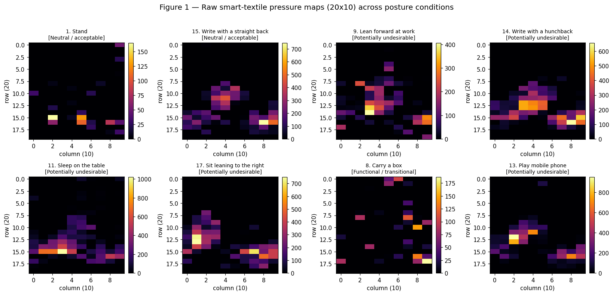
</p>

<p align="center">
  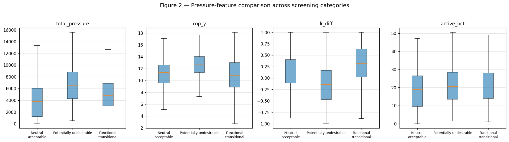
</p>

### Model comparison (unseen test subjects)

| Model | Acc. | Bal. Acc. | Macro F1 | ROC AUC |
|---|---|---|---|---|
| Logistic Regression | 0.730 | 0.668 | 0.681 | 0.873 |
| Random Forest | 0.793 | 0.737 | 0.762 | 0.933 |
| **XGBoost** | **0.818** | **0.788** | **0.801** | **0.942** |
| TinyCNN (raw frames) | 0.814 | 0.779 | 0.795 | n/a |

<p align="center">
  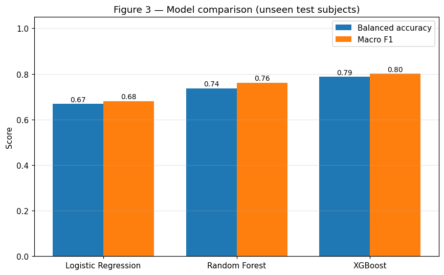
</p>

### Confusion matrix and per-activity behavior

The undesirable class acts as an attractor for ambiguous frames. Direct neutral-functional confusion stays at or below 0.09.

<p align="center">
  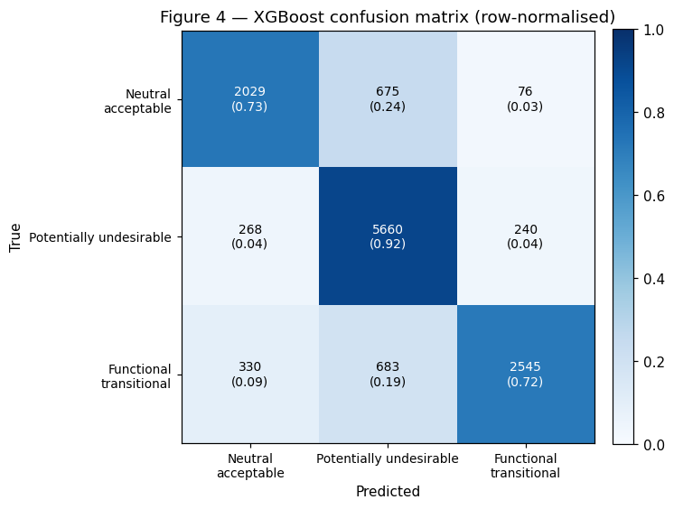
</p>

Inside the pooled *potentially undesirable* class, recall varies widely by source activity. Dense, concentrated contact signatures are easiest, and diffuse ones are hardest.

<p align="center">
  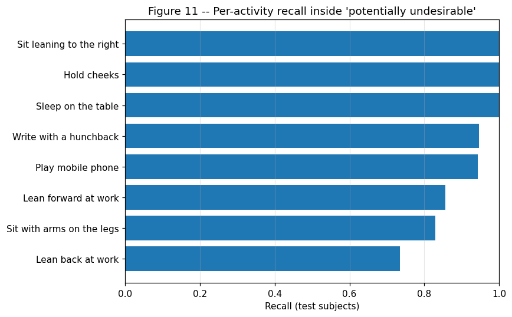
</p>

| Activity | Recall |
|---|---|
| Sit leaning to the right / Hold cheeks / Sleep on the table | 1.000 |
| Write with a hunchback | 0.946 |
| Play mobile phone | 0.944 |
| Lean forward at work | 0.856 |
| Sit with arms on the legs | 0.829 |
| Lean back at work | 0.735 |

### Leave-one-subject-out (LOSO) cross-validation

Mean macro F1 is **0.770 (SD 0.059)**, with a range of 0.666 to 0.887. The subject-level spread (about ±0.06) is roughly six times wider than the frame-level bootstrap interval.

<p align="center">
  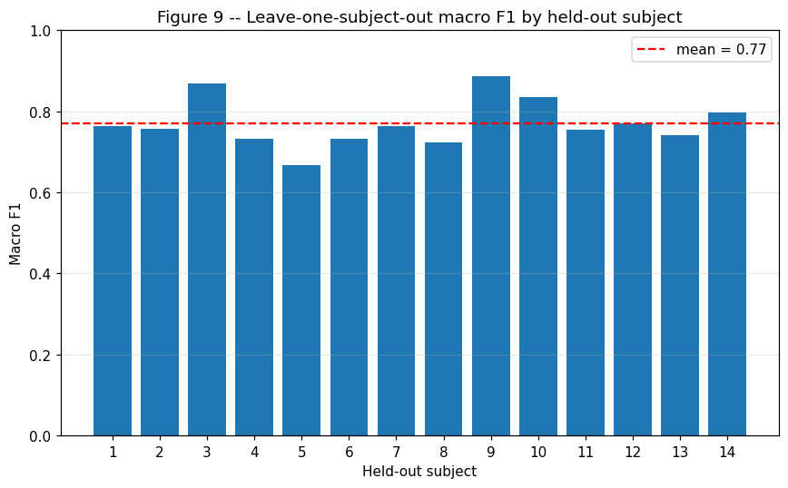
</p>

### Feature-group ablation

Spatial features alone reach 0.64 macro F1, versus 0.80 for the full set, so no single feature family is sufficient.

<p align="center">
  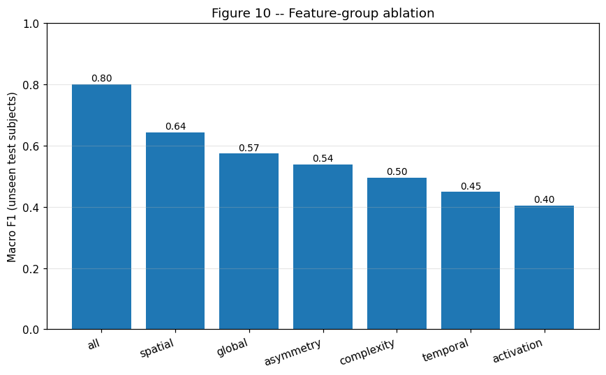
</p>

| Feature group | # feats | Macro F1 |
|---|---|---|
| All | 29 | 0.801 |
| Spatial | 6 | 0.643 |
| Global intensity | 9 | 0.574 |
| Asymmetry | 6 | 0.539 |
| Complexity | 3 | 0.495 |
| Temporal | 2 | 0.449 |
| Activation area | 3 | 0.405 |

### Class-mapping sensitivity

| Mapping | Acc. | Bal. Acc. | Macro F1 |
|---|---|---|---|
| Original | 0.818 | 0.788 | 0.801 |
| Alt. A (borderline swap) | 0.841 | 0.790 | 0.810 |
| Alt. B (stricter undesirable) | 0.827 | 0.815 | 0.815 |

Performance is not an artifact of one arbitrary mapping choice.

---

## Explainability (SHAP)

`cop_x` and `var_x` (position and spread of pressure along the 10-taxel **circumferential** axis) are the most influential features. They outweigh `std_pressure` and `cop_y` (lengthwise position). For this sleeve geometry, *which side of the forearm* makes contact matters more than *how far up or down* it extends.

<p align="center">
  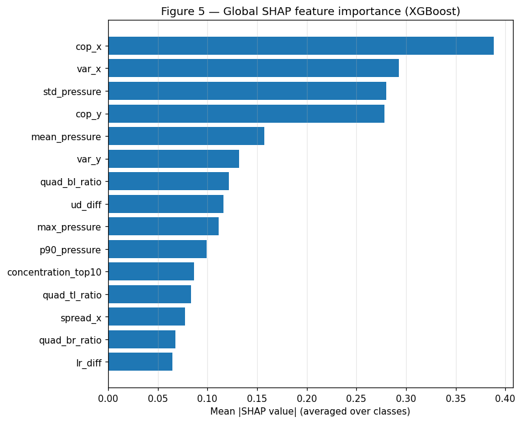
</p>

<p align="center">
  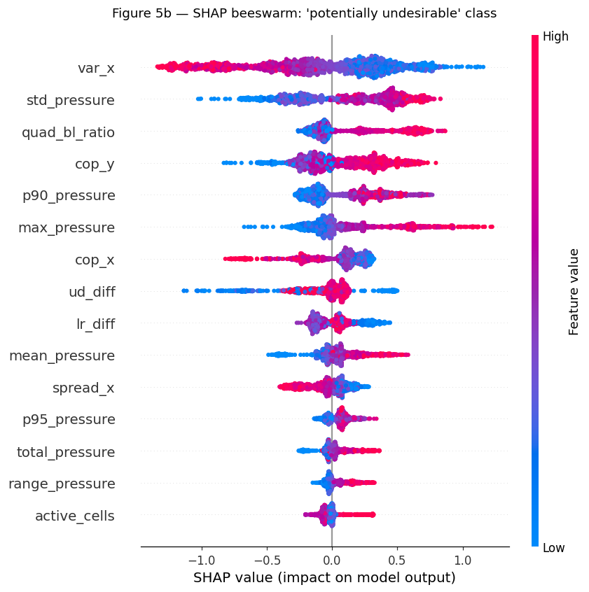
</p>

Individual-frame explanations follow the same global ranking:

<p align="center">
  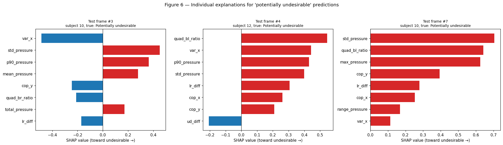
</p>

**Case example: pressure pattern → AI decision → contributing features**

<p align="center">
  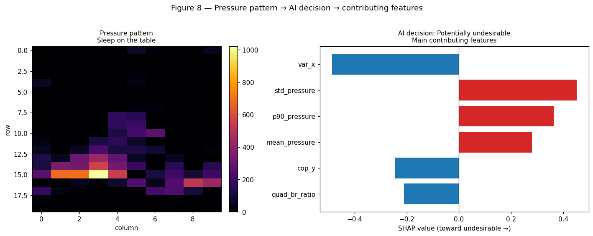
</p>

---

## Robustness to Donning Rotation

The frozen XGBoost model is evaluated on test frames whose 10-column axis is circularly shifted by ±1, ±2, ±3 taxels, which simulates the sleeve being worn rotated. The degradation is asymmetric, and negative shifts hurt more, consistent with `cop_x` being the top SHAP feature.

<p align="center">
  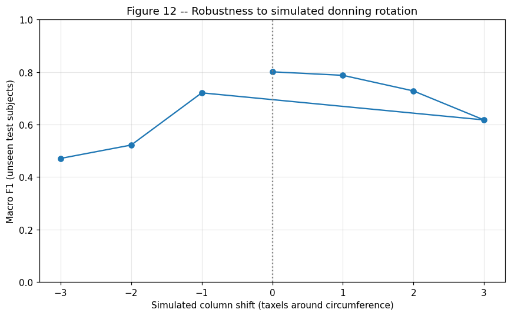
</p>

| Shift (taxels) | −3 | −2 | −1 | 0 | +1 | +2 | +3 |
|---|---|---|---|---|---|---|---|
| Macro F1 | 0.471 | 0.522 | 0.721 | **0.801** | 0.787 | 0.728 | 0.618 |

A two-taxel donning offset alone costs about 7 macro-F1 points in the positive direction and nearly 28 in the negative direction. A real deployment would need an orientation marker, an alignment step at donning, or rotation-augmented training.

---

## Limitations

- Screening categories are heuristic (derived from activity semantics), not validated against biomechanical or clinical outcomes.
- 14 right-handed subjects with the sleeve on the right arm, so demographic and anatomical diversity is limited.
- Rotation was tested only along the circumferential axis.

**Future work:** larger and more diverse cohorts, lengthwise-axis rotation plus rotation-augmented training, sequence models for longer temporal context, benchmarking against other pressure-sensing screening pipelines, and validation against expert ergonomic assessment.

---

## Repository Structure

```
.
├── figs/                 # all figures used in this README and the paper
│   ├── Activities.png
│   ├── Smart-Sleeve.png
│   ├── fig_pressure_maps.png
│   ├── fig_feature_compare.png
│   ├── fig_model_compare.png
│   ├── fig_confusion.png
│   ├── fig_subcluster.png
│   ├── fig_loso.png
│   ├── fig_ablation.png
│   ├── fig_shap_global.png
│   ├── fig_shap_beeswarm.png
│   ├── fig_shap_individual.png
│   ├── fig_case_example.png
│   └── fig_rotation.png
├── README.md
└── ...                   # add your code / notebooks / paper PDF here
```

---

## Getting Started

> Replace this section with your actual commands once your code is uploaded.

```bash
git clone https://github.com/<your-username>/<your-repo>.git
cd <your-repo>
pip install -r requirements.txt

# 1. Download the Smart-Sleeve dataset
#    https://github.com/xghgithub/Smart-Sleeve-Dataset

# 2. Extract features, train, and evaluate
python <your_script>.py
```

---

## Citation

If you use this work, please cite:

```bibtex
@misc{sleevefeels2026,
  title  = {What the Sleeve Feels: Explainable Machine Learning for Textile Pressure-Based Postural Screening},
  author = {<Your Name> and <Co-authors>},
  year   = {2026},
  note   = {GitHub repository: https://github.com/<your-username>/<your-repo>}
}
```

Please also cite the original dataset:

> G. Xu, W. Deng, and J. Cheng, "Smart-Sleeve dataset based on pressure mapping smart textile," GitHub repository, University of Science and Technology of China, 2023. https://github.com/xghgithub/Smart-Sleeve-Dataset

---

## Acknowledgements

Thanks to the authors of the Smart-Sleeve dataset for making the data publicly available.

## License

<!-- Choose a license, e.g. MIT -->
This project is released under the **<License Name>** license. See `LICENSE` for details.
